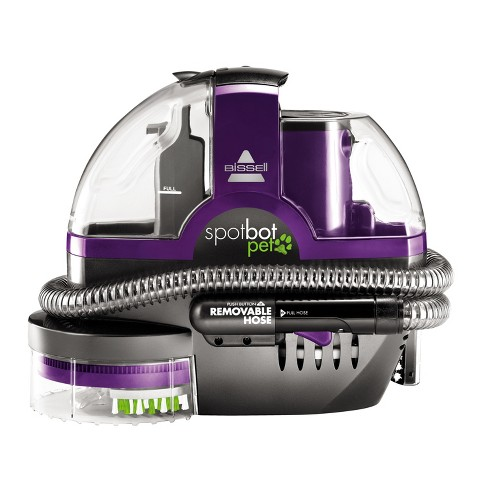
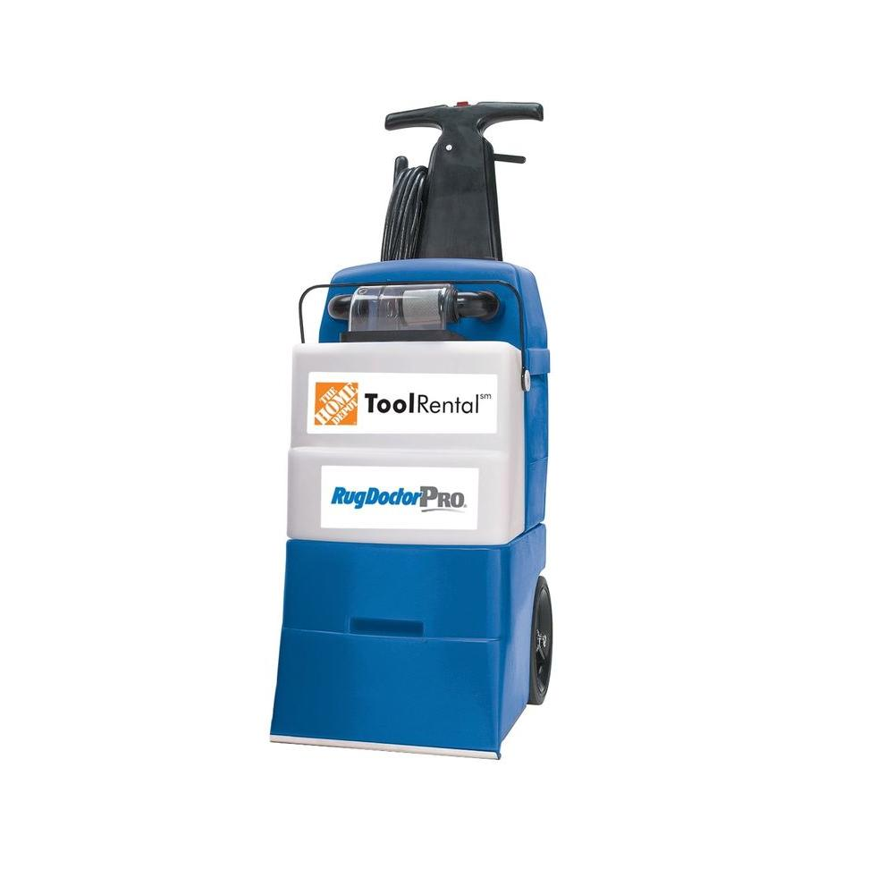

exclude: true

```{r setup, include=FALSE, echo=FALSE, message=FALSE, warning=FALSE}
options(htmltools.dir.version = FALSE)
knitr::opts_chunk$set(
      dev = "svglite",
      fig.ext = ".svg"
)
library(tidyverse)
library(ggplot2)
library(showtext)
library(woRthington)
library(ggalt)   # devtools::install_github("hrbrmstr/ggalt")
library(rvest)
library(DT)
library(sysfonts)
font_add(family = "IBM Plex Sans", regular = "IBMPlexSans-Regular.otf", bold = "IBMPlexSans-Bold.otf", italic = "IBMPlexSans-Italic.otf")
```

---

# Do Now: Inefficient Work

## Prompt:
* As you come in, grab coffee, some pastries, and find a partner. When you find one, each take no more than three minutes to share an example of a time where you or someone you knew had to accomplish a herculean task *<u>and</u>* you/they:

	* <u>Had the wrong tools</u>, which made accomplishing that task completely inefficient, arduous, and more painful than you could have ever imagined. And, to this day, you sometimes have night terrors about that experience.
	
	* <u>Had the right tools</u> to do that work, which made the work efficient, reasonable, and less burdensome—maybe even enjoyable—than it could have without those tools. 
	
???
#Shareout Activity

Ask A Few Folks To Share Their Partner’s Story

---

# My Example of Working Efficiently

.pull-left[

## Champ's Meltdown

1. Had A Vet Visit

2. We Left Town (He stayed with sitter)

3. Combined Stress made him sick

4. I chose between.... 

  ]
  
.pull-right.center.contain[


  ]
  
???
#My Story: 
After everyone shares their example, share my example of cleaning up after champ—my dog—when he got sick recently and destroyed our house with explosive diarrhea.

---
class: graphic
# My Choices For Cleanup

.pull-left[

## Bissel Spot Cleaner



  ]
  
.pull-right[

## Rug Doctor Pro


]

---
class: center, middle, inverse

# Welcome

<html><div style='float:left'></div><hr color='#bf5700' size=1px width=1100px></html>

---

## Slide

* Goal 1: redress past patterns of discrimination

* Goal 2: make the bureaucracy more representative of the overall population

---

## Slide

* Goal 1: redress past patterns of discrimination

* Goal 2: make the bureaucracy more representative of the overall population


---
class: center, middle, inverse

# Section

<html><div style='float:left'></div><hr color='#bf5700' size=1px width=1100px></html>

---

## Slide

* Goal 1: redress past patterns of discrimination

* Goal 2: make the bureaucracy more representative of the overall population

---

## Slide

* Goal 1: redress past patterns of discrimination

* Goal 2: make the bureaucracy more representative of the overall population


---
class: center, middle, inverse

# Section

<html><div style='float:left'></div><hr color='#bf5700' size=1px width=1100px></html>

---

## Slide

* Goal 1: redress past patterns of discrimination

* Goal 2: make the bureaucracy more representative of the overall population

---

## Slide

* Goal 1: redress past patterns of discrimination

* Goal 2: make the bureaucracy more representative of the overall population


---
class: center, middle, inverse

# Section

<html><div style='float:left'></div><hr color='#bf5700' size=1px width=1100px></html>

---

## Slide

* Goal 1: redress past patterns of discrimination

* Goal 2: make the bureaucracy more representative of the overall population

---

## Slide

* Goal 1: redress past patterns of discrimination

* Goal 2: make the bureaucracy more representative of the overall population


---
class: center, middle, inverse

# Section

<html><div style='float:left'></div><hr color='#bf5700' size=1px width=1100px></html>

---

## Slide

* Goal 1: redress past patterns of discrimination

* Goal 2: make the bureaucracy more representative of the overall population

---

## Slide

* Goal 1: redress past patterns of discrimination

* Goal 2: make the bureaucracy more representative of the overall population


---
class: center, middle, inverse

# Section

<html><div style='float:left'></div><hr color='#bf5700' size=1px width=1100px></html>

---

## Slide

* Goal 1: redress past patterns of discrimination

* Goal 2: make the bureaucracy more representative of the overall population

---

## Slide

* Goal 1: redress past patterns of discrimination

* Goal 2: make the bureaucracy more representative of the overall population


---
class: top

# OPM Inclusion Sentiments from FEVS <sup>1</sup>

```{r Diversity Stats OPM, echo=FALSE, message=FALSE, warning=FALSE}
url <- "https://www.opm.gov/policy-data-oversight/diversity-and-inclusion/federal-workforce-at-a-glance/"
hiring <- url %>%
  read_html() %>%
  html_nodes(xpath='//*[@id="ctl01_ctl00_MainContentPlaceHolder_MainContentPlaceHolder_InclusionPanel"]/table') %>%
  html_table()
hiring <- hiring[[1]]
# Code To Render DataTable Widget
datatable(head(hiring, 10),
          fillContainer = FALSE, rownames = FALSE,
          options = list(pageLength = 8))
```
.footnote[
[1] Federal Employee Viewpoint Survey. http://www.fedview.opm.gov/
]

???
This is data from the Federal Employee Viewpoint Survey (FEVS), which captures something OPM calls the Inclusion Quotient, to get a sense about how these groups feel about their work environment. OPM says numbers should be improving over time, but they are not. 

---
background-image: url(https://mrworthington.github.io/idyll-test/images/background-image.jpg)
background-size: cover
class: left, top, inverse, image-light-header

# The Federal Government & Edgewood

<html><div style='float:left'></div><hr color='#bf5700' size=4px width=1100px></html>

---
class: top

# Kelly Air Force Base

<html><div style='float:left'></div><hr color='#bf5700' size=1px width=1100px></html>

--

* Was San Antonio's largest employer in 1969, and one of the country's largest military installations for most of the 20th century.

--

* By December 1968, 126 formal complaints had been registered at Kelly and six studies were published analyzing patterns of racial discrimination documented between 1917-1966.

--

* Mexican civil service employees seeking higher grade promotions were equal to white peers on academic aptitude exams and leadership appraisal assessments, but were disporportionately rejected for grade level promotions compared to white peers on base.

--

* According to a 1969 Report produced by the Department of Defense, Mexican civil service employees and other minorities employed at Kelly expressed wide-spread distrust with the government's equal employment opportunity office, whom they said lacked the integrity to actually follow through on commitments they wanted to make.

---
class: center, middle, graphic
# Slide 4

```{r Edgewood Map Build, fig.align='center', fig.height=8, fig.pos='p', fig.retina=TRUE, fig.width=15, message=FALSE, warning=FALSE, dpi=600, include=FALSE, paged.print=FALSE}
library(sf)
library(tigris)
library(lwgeom)
library(ggplot2)
library(woRthington)
library(cowplot)
library(viridis)
library(ggsn)
library(raster)
library("tidyverse")
options(tigris_class = "sf")
options(tigris_use_cache = TRUE)

file_name <- system.file("maps/Kelly_AFB_vs_Edgewood.shp", package="sf")
KvE <- st_read("data/Kelly_AFB_vs_Edgewood.shp", quiet = TRUE)
KvE <- subset(KvE, select=c('geometry', 'Name'))
KvE <- st_transform(KvE, crs = 102740)
roads <- roads("Texas", "029", refresh = TRUE)
roads <- st_transform(roads, crs = 102740)
roads <- roads %>%
  dplyr::filter(RTTYP %in% c("I"))
schools <- school_districts("Texas", type = "unified", refresh = TRUE)
schools <- subset(schools, select=c('geometry', 'GEOID', 'NAME'))
schools <- st_transform(schools, crs = 102740)
schools <- schools %>%
  dplyr::filter(GEOID %in% c("4807590", "4822470", "4818150", "4838730", "4840680", "4840740", "4832940", "4817850", "4840950", "4833120", "4824990", "4840920"))
# KvE <- KvE %>% mutate(
  # area = st_area(KvE))
# %>% 
#   set_units(area, km^2)

```

```{r Edgewood Map Display, echo=FALSE, fig.align='center', fig.height=9, fig.pos='p', fig.retina=TRUE, fig.width=16, message=FALSE, warning=FALSE, dpi=600, paged.print=FALSE, fig.showtext=TRUE}
showtext_auto()
Map <- KvE %>%
  ggplot() +
  geom_sf(data = KvE, aes(fill = Name)) +
  theme_plex() +
  theme(plot.title=element_text(face="bold", size=40, family = "IBM Plex Sans"),
        plot.subtitle=element_text(face="italic", size=18, family = "IBM Plex Sans"),
        plot.caption=element_text( size=9, family = "IBM Plex Sans"),
        legend.title=element_text(face="bold", size=8, family = "IBM Plex Sans"),
        legend.text=element_text(size=7, family = "IBM Plex Sans"),
        legend.position = c(1.1, 0)) +
  coord_sf(crs = 102740, datum = NA) + 
    scale_fill_viridis(name = "Property", discrete = "TRUE", option = "cividis", guide=TRUE) +
    labs(
      title = "Kelly Air Force Base & Edgewood ISD",
      subtitle = "A 1968 Civil Rights Commission Report noted that with Kelly Air Force Base encompassing 1/4 of Edgewood ISD’s property \nand 13.5 percent of Edgewood students living in tax-exempt public housing, the district had significantly limited \nopportunity to generate money through property taxes.",
      caption = "Note: Kelly AFB boundary is a cartographic estimate from the author. \nSource: 2017 TIGER/Line Shapefiles from the TIGRIS package, courtesy of the U.S. Census Bureau, 2017."
    ) + 
    guides(fill = guide_legend(keywidth = 3, keyheight = .8, direction="vertical", 
                               title="Kelly AFB vs. Edgewood ISD", title.position = "top", label.position = "right"))
inset <- schools %>%
  ggplot() +
  geom_sf(data = schools, aes(fill="gray"), alpha = .05, size = .1, show.legend = TRUE) +
  # guides(fill = guide_legend(keywidth = 3, keyheight = .8, direction="vertical", title=NULL, label.position = "right")) +
  geom_sf(data = roads, size = .3, show.legend = TRUE) +
  geom_sf(data = KvE, aes(fill = Name), show.legend = FALSE) +
  theme_mworth() +
  theme(plot.subtitle=element_text(face="italic", size=9, family = "IBM Plex Sans")) +
  coord_sf(crs = 102740, datum = NA) +
  scale_colour_hue(l = 40, c = 30) +
  scale_fill_viridis(name = "Property", discrete = "TRUE", option = "cividis", guide=FALSE)
plot <- ggdraw() +
  draw_plot(Map + theme(legend.justification = "bottom"), -.3, -0.02, 1.01, 1.01) +
  draw_plot(inset + theme(legend.justification = "top"), .32, .05, 0.8, 0.8) +
  theme(plot.background = element_blank(),
        line = element_line())
  # save_plot("plot2by2.png", plot, base_aspect_ratio = 1.7, dpi = 300)
return(plot)

```


---
class: center, middle, graphic
# Slide 6

```{r 1968 Build, echo=FALSE, fig.align='center', fig.height=9, fig.pos='p', fig.retina=TRUE, fig.width=16, message=FALSE, warning=FALSE, dpi=600}

# url <- "https://archive.opm.gov/oca/pre1994/GS1968.asp"
# GSpay1968 <- url %>%
#   read_html() %>%
#   html_nodes(xpath='//*[@id="container_mainv3"]/div[4]/div[1]/table') %>%
#   html_table() 
# GSpay1968 <- GSpay1968[[1]] 
# GSpay1968 %>%
#   mutate(
#     type = case_when(
#      is.na(Grade == 16) ~ "28923",
#      is.na(Grade == 17) ~ "29764",
#      is.na(Grade == 18) ~ "30239"
#      )
#     )
GSpay1968 <- read_csv("data/GSpay1968.csv", 
    col_types = cols(X1 = col_skip()))
# inflation <- read_csv("data/inflation.csv")

# GSpay1968[is.na(GSpay1968)] <- 0

#1968 Inflation Index 7.013678

GSpay1968 <- GSpay1968 %>% mutate(
  `Step 1` = (`Step 1`*7.013678)/1000,
  `Step 5` = (`Step 5`*7.013678)/1000,
  `Step 10` = (`Step 10`*7.013678)/1000,
  diff = sprintf("+$%dK", as.integer((`Step 10`-`Step 1`))),
  Grade = as.character(Grade)) %>% 
  mutate(Grade = as_factor(Grade))
GSpay1968$Grade <- factor(GSpay1968$Grade, levels = rev(GSpay1968$Grade[order(GSpay1968$Grade)]))

# fnc = function(var, decimal.places) {
#   var = sprintf(paste0("%2.",decimal.places,"f"), var)
#   var[var=="NA"] = ""
#   var
# }
# vars = c('diff15', 'diff16','diff17','diff18')
# GSpay1968[ , vars] = mapply(fnc, GSpay1968[ ,vars], 2:3)
```

```{r 1968 Display, echo=FALSE, fig.retina=TRUE, fig.width=16, fig.height=9, dpi = 600, message=FALSE, warning=FALSE, fig.pos='p', fig.align='center', , fig.showtext=TRUE}
showtext_auto()
gg <- ggplot()
gg <- gg + 
  # reference line
  geom_vline(xintercept = 85, colour = "red", linetype = 1, size = .6, alpha = .5) +
  geom_segment(data=GSpay1968, aes(y=Grade, yend=Grade, x=0, xend=260), color="#b2b2b2", size=0.15)

# dum…dum…dum!bell
gg <- gg + geom_dumbbell(data=GSpay1968, aes(y=Grade, x=`Step 1`, xend=`Step 10`),
                         size=1.5, color="#b2b2b2",size_x=3, size_xend=3,
                         colour_x="#9fb059", colour_xend="#edae52")
# text below points
gg <- gg + 
  geom_text(data=filter(GSpay1968, Grade=="1"),
                     aes(x=`Step 1`, y=Grade, label="1"),
                     color="#9fb059", size=5, vjust=-1, fontface="bold", family="IBM Plex Sans") + 
  geom_text(data=filter(GSpay1968, Grade=="1"),
                     aes(x=`Step 10`, y=Grade, label="10"),
                     color="#edae52", size=5, vjust=-1.1, fontface="bold", family="IBM Plex Sans") +
  geom_text(data=filter(GSpay1968, Grade=="1"),
                     aes(x=`Step 5`, y=Grade, label="STEPS"),
                     color="#b2b2b2", size=5, vjust=-2.5, hjust=.5, fontface="bold", family="IBM Plex Sans") + 
# text above points
  geom_text(data=GSpay1968, 
            aes(x=`Step 1`, y=Grade, label=ifelse(`Step 1`>1,paste0("$", round(`Step 1`,0), "K"),"")),
            color="#9fb059", size=6, vjust=1.9, hjust=.75, family="IBM Plex Sans", fontface="bold") +
  geom_text(data=GSpay1968, 
            aes(x=`Step 10`, y=Grade, label=ifelse(`Step 10`>1,paste0("$", round(`Step 10`,0), "K"),"")),
            color="#edae52", size=6, vjust=1.9, hjust=-0.5, family="IBM Plex Sans", fontface="bold") +
# difference column
  geom_rect(data=GSpay1968, 
            aes(xmin=240, xmax=260, ymin=-Inf, ymax=Inf), fill="#efefe3") +
  geom_text(data=GSpay1968, 
            aes(label=diff, y=Grade, x=250), 
            fontface="bold", size=6, 
            family="IBM Plex Sans") +
  geom_text(data=filter(GSpay1968, Grade=="1"), 
            aes(x=250, y=18, label="DIFF"),
            color="#7a7d7e", size=6, vjust=-2, fontface="bold", family="IBM Plex Sans") +
# formatting & labeling of the chart
  scale_x_continuous(expand=c(0,0.5), limits=c(0, 260)) +
  scale_y_discrete(expand=c(0.1,0)) +
  labs(x=NULL, y=NULL, 
       title="In 1968, Mexican Workers At Kelly AFB Wanted Promotions",
       subtitle="Despite scoring as high on academic aptitude exams and scoring higher on leadership appraisal assessments compared to \nwhite Kelly Workers, few Mexican employees were able to get promotions beyond GS 10.",
       caption="Source: Office of Personnel Management, 1968 Rates of Pay Under the General Schedule; Annual Rates by Grade and Step.\nNote: 1968 Figures have been adjusted for inflation to 2017 real dollars, using the All-Consumer Series Index from the Bureau of Labor Statistics.") +
  theme_mworth(base_family = "IBM Plex Sans") +
  theme(panel.background = element_rect(fill = "#ffffff", color = "#ffffff"),
        plot.background = element_rect(fill = "#ffffff", color = "#ffffff"),
        panel.grid.major=element_blank(),
        panel.grid.minor=element_blank(),
        panel.border=element_blank(),
        axis.ticks=element_blank(),
        axis.text.x=element_blank(),
        axis.text.y=element_text(face="bold", size = 16),
        axis.title.x=element_blank(),
        axis.title.y=element_blank(),
        plot.title=element_text(face="bold", size= 35, family = "IBM Plex Sans"),
        plot.subtitle=element_text(face="italic", size=20, family = "IBM Plex Sans", margin=margin(b=12)),
        plot.caption=element_text(size=12, margin=margin(t=12), color="#7a7d7e", family = "IBM Plex Sans"))
# ggsave("graphic1968.png", plot = gg, device = "png", dpi=300)
return(gg)
# Code To Render DataTable Widget
# datatable(head(GSpay1968, 10), 
#           fillContainer = FALSE, rownames = FALSE, 
#           options = list(pageLength = 8)) %>% 
#   formatCurrency(3:12, currency = "$", interval = 3, mark = ",", digits = 0)
```

---
class: center, middle, graphic

# Slide 7

```{r 2018 GS Schedule, echo=FALSE, fig.retina=TRUE, fig.width=16, fig.height=9, dpi = 600, message=FALSE, warning=FALSE, fig.pos='p', fig.align='center', fig.showtext=TRUE}
url <- "https://www.opm.gov/policy-data-oversight/pay-leave/salaries-wages/salary-tables/18Tables/html/GS.aspx"
GSpay2018 <- url %>%
  read_html() %>%
  html_nodes(xpath='//*[@id="ctl01_MainContentPlaceHolder_divSingleTable"]/table') %>%
  html_table() 
GSpay2018 <- GSpay2018[[1]]
#1968 Inflation Index 7.013678
GSpay2018 <- GSpay2018 %>% as_tibble() %>% mutate(
  `Step 1` = `Step 1`/1000,
  `Step 5` = `Step 5`/1000,
  `Step 10` = `Step 10`/1000,
  diff = sprintf("+$%dK", as.integer((`Step 10`-`Step 1`))),
  Grade = as.character(Grade)) %>% 
  mutate(Grade = as_factor(Grade))
GSpay2018$Grade <- factor(GSpay2018$Grade, levels = rev(GSpay2018$Grade[order(GSpay2018$Grade)]))

showtext_auto()

gg <- ggplot()
gg <- gg + geom_segment(data=GSpay2018, aes(y=Grade, yend=Grade, x=0, xend=150), color="#b2b2b2", size=0.15)

# dum…dum…dum!bell
gg <- gg + 
# reference line
  geom_vline(xintercept = 63, colour = "red", linetype = 1, size = .6, alpha = .5) +
  geom_dumbbell(data=GSpay2018, aes(y=Grade, x=`Step 1`, xend=`Step 10`),
                         size=1.5, color="#b2b2b2",size_x=3, size_xend=3,
                         colour_x="#9fb059", colour_xend="#edae52")
# text below points
gg <- gg + 
  geom_text(data=filter(GSpay2018, Grade=="1"),
                     aes(x=`Step 1`, y=Grade, label="1"),
                     color="#9fb059", size=5, vjust=-1.1, fontface="bold", family="IBM Plex Sans") + 
  geom_text(data=filter(GSpay2018, Grade=="1"),
                     aes(x=`Step 10`, y=Grade, label="10"),
                     color="#edae52", size=5, vjust=-1.1, fontface="bold", family="IBM Plex Sans") +
  geom_text(data=filter(GSpay2018, Grade=="1"),
                     aes(x=`Step 5`, y=Grade, label="STEPS"),
                     color="#b2b2b2", size=5, vjust=-2.5, hjust=.5, fontface="bold", family="IBM Plex Sans") + 
# text above points
  geom_text(data=GSpay2018, 
            aes(x=`Step 1`, y=Grade, label=ifelse(`Step 1`>1,paste0("$", round(`Step 1`,0), "K"),"")),
            color="#9fb059", size=6, vjust=2.25, hjust=.75, family="IBM Plex Sans", fontface="bold") +
  geom_text(data=GSpay2018, 
            aes(x=`Step 10`, y=Grade, label=ifelse(`Step 10`>1,paste0("$", round(`Step 10`,0), "K"),"")),
            color="#edae52", size=6, vjust=2.25, hjust=0.05, family="IBM Plex Sans", fontface="bold") +
# difference column
  geom_rect(data=GSpay2018, 
            aes(xmin=155, xmax=170, ymin=-Inf, ymax=Inf), fill="#efefe3") +
  geom_text(data=GSpay2018, 
            aes(label=diff, y=Grade, x=162.5), 
            fontface="bold", size=6, 
            family="IBM Plex Sans") +
  geom_text(data=filter(GSpay2018, Grade=="1"), 
            aes(x=162.5, y=15, label="DIFF"),
            color="#7a7d7e", size=6, vjust=-2, fontface="bold", family="IBM Plex Sans") +
# formatting & labeling of the chart
  scale_x_continuous(expand=c(0,0.5), limits=c(0, 170)) +
  scale_y_discrete(expand=c(0.1,0)) +
  labs(x=NULL, y=NULL, 
       title="2018 GS Grade and Step Wages",
       subtitle="Today's current GS Schedule from OPM",
       caption="Source: Office of Personnel Management, Pay Tables - 2018 General Schedule (Base); Annual Rates.") +
  theme_mworth(base_family = "IBM Plex Sans") +
  theme(panel.background = element_rect(fill = "#ffffff", color = "#ffffff"),
        plot.background = element_rect(fill = "#ffffff", color = "#ffffff"),
        panel.grid.major=element_blank(),
        panel.grid.minor=element_blank(),
        panel.border=element_blank(),
        axis.ticks=element_blank(),
        axis.text.x=element_blank(),
        axis.text.y=element_text(face="bold", size = 16),
        axis.title.x=element_blank(),
        axis.title.y=element_blank(),
        plot.title=element_text(face="bold", size= 35, family = "IBM Plex Sans"),
        plot.subtitle=element_text(face="italic", size=20, family = "IBM Plex Sans", margin=margin(b=12)),
        plot.caption=element_text(size=12, margin=margin(t=12), family = "IBM Plex Sans", color="#7a7d7e"))
# ggsave("graphic2018.png", plot = gg, device = "png", dpi=300)
return(gg)
```

---

# Questions

**1.** Does the government's current diversity inclusion intiative--which provides preferential treatment in hiring decisions--do enough to reverse past patterns of discrimination among civil service employees, considering the vast amount of wages that were lost because of the government's past action. 

**2.** What obligation, if any, should the government have to promote equity in scenarios where civil service employees---who spent their whole careers in civil service---were routinely turned down for jobs they were qualified for at disportionately high rates, leaving them with substantial lack of wealth?

**3.** What are other ways the government could improve its effectiveness of achieving it's two social goals: redressing past patterns of discrimination and making the government more representative of the people it serves?

---

