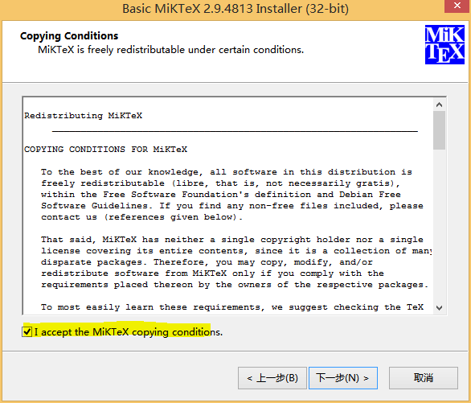
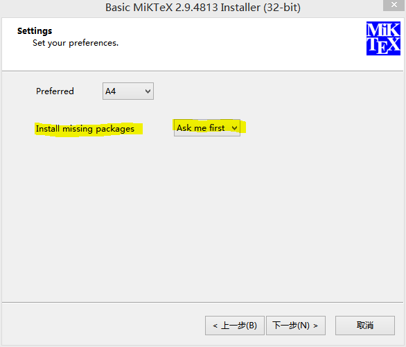

**Note:** Clicking the links below will take you directly to the download file, which means a pkg will start downloading. I've done this to help ease any confusion about which items to download.

## Step 1: Download & Install R

  * [Download link For Windows](https://cran.rstudio.com/bin/windows/base/R-3.4.3-win.exe)
  
## Step 2: Download & Install RStudio

  * [Download link For Windows Vista/7/8/10](https://download1.rstudio.org/RStudio-1.1.423.exe)

## Step 3: Download & Install Latex for Windows (MikTex) {.tabset}

  * [Download link for MikTex](https://miktex.org/download/ctan/systems/win32/miktex/setup/windows-x64/basic-miktex-2.9.6615-x64.exe)

### Instructions

  * After downloading, run the MiKTeX installer by opening the download package. 
  * When prompted, choose to install missing packages automatically.
  * At this point you are done!

### Screenshot 1



### Screenshot 2



## Step 4: Install `rmarkdown` with RStudio {.tabset}

### Instructions 

* Open RStudio from your applications folder.
* Then, copy & paste this code into the console: 
```r
install.packages("rmarkdown")
```
* If the console prompts you to install dependencies, type "y" and hit enter.

### Console Example

