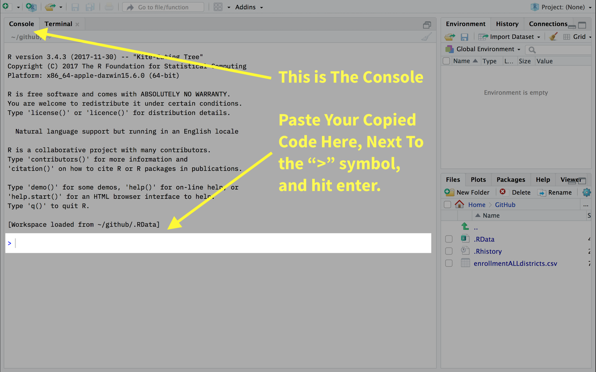

**Note:** Clicking the links below will take you directly to the download file, which means a pkg will start downloading. I've done this to help ease any confusion about which items to download.

## Step 1: Download R

  * [Download link For Windows](https://cran.rstudio.com/bin/windows/base/R-3.4.3-win.exe)
  
## Step 2: Download RStudio

  * [Download link For Windows Vista/7/8/10](https://download1.rstudio.org/RStudio-1.1.423.exe)

## Step 3: Install `rmarkdown` & `tinytex` {.tabset}

### Instructions

After you've Steps 1-3, follow these steps:

* Open RStudio from you applications folder.
* Then, copy & paste this code into the console: ```install.packages("devtools")```
* Next, copy and paste this code into the console: ```devtools::install_github(c('yihui/tinytex', 'rstudio/rmarkdown'))
tinytex::install_tinytex()```
  - If the console prompts you to install dependencies, type "y" and hit enter.

### Console Example

